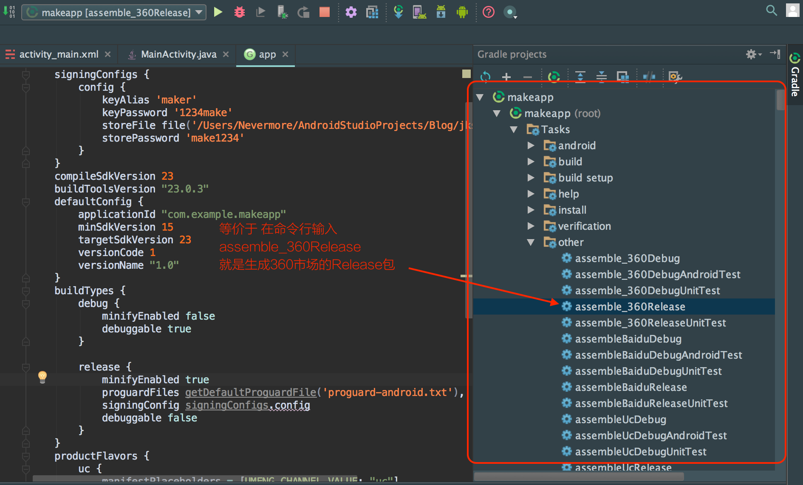

一.命令行生成keystore.jks 文件

1.keytool -genkeypair -alias icesslkey -keyalg RSA -validity 3650 -keystore icekeystore.jks

* keytool -genkeypair（生成key命令）
* -alias icesslkey(icesslkey是我们第3步中取的别名)
*  -keyalg RSA(RSA是非对称密钥算法,也可以改为keytool支持的其他密钥算法)
* -vlidity 3650(3650是证书有效期)
* -keystroe  icekeystore.jks( icekeystore.jks是生成的keystore名称)

2.keytool -importkeystore -srckeystore icekeystore.jks -destkeystore icekeystore.jks -deststoretype pkcs12

二. 打包命令

  1.测试版：gradle assembleDebug

  2.正式版：gradle assembleRelease
  3.具体渠道的正式包如（_360）： gradle assemble_360Release

  UI 操作如下
  

  3.删除未用到的中间apk的命令
    find . -name "*-unaligned.apk" | xargs rm -rf